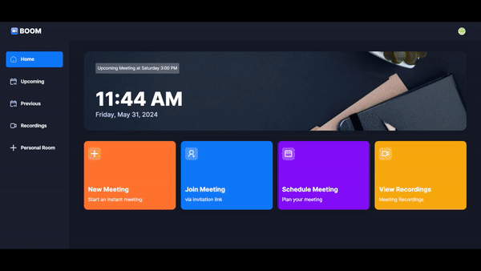

# Video Conference App
This is one of my learning React projects, a video conference application built using React with TypeScript and Next.js.

## Features
- **Instant Meeting**: Start a meeting instantly and invite people in via a shareable invitation link
- **Schedule Meeting**: Schedule a meeting for a later time
- **Recordings**: Review recordings of the previous meeting
- **Personal Room**: A personal meeting room with a fixed invitation link
- **Preview Setup**: Disable audio/video before joining a meeting room
- **Meeting Room Control**: Control audio, video, layout, participant, and screen sharing during the meeting

## Demo

> [!NOTE]
> Sorry for the fps drop, I need to sacrifice some fps to cram a 40s-ish video into gif

> [!NOTE]
> Or you can take a peek (need to sign-up though) [here](https://boom-video-conference.netlify.app/).

## Technology Used
- [TypeScript](https://www.typescriptlang.org/) - Language
- [Next.js](https://nextjs.org/) - Framework
- [Tailwind](https://tailwindcss.com/) - Styling
- [shadcn/ui](https://ui.shadcn.com/) - UI Components
- [Clerk](https://clerk.com/) - Authentication
- [Stream.io](https://getstream.io/) - Video Streaming
- [Netlify](https://app.netlify.com/) - Hosting
